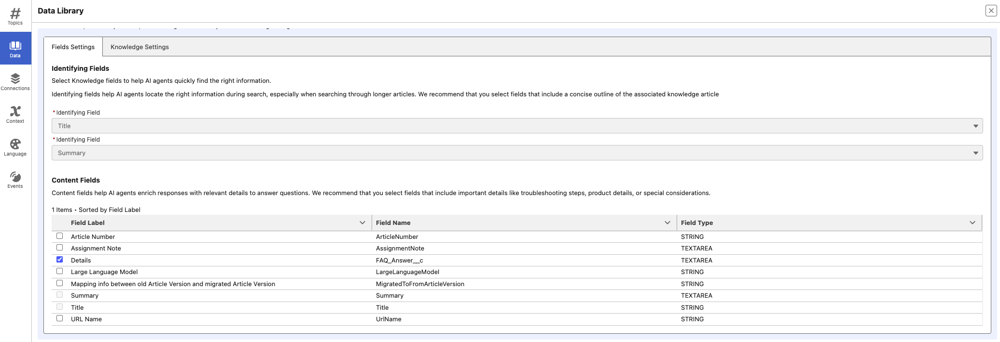

# Agentforce-Podcast


👋 Hello and welcome to Architect’s Guide to Salesforce Agentforce 360! 🌟
This repo will consists of all the source metadata which I have been used to setup **Agentforce** and showcased during my **Youtube Podcast**.

This repository contains all the source metadata used to set up **Agentforce** and demonstrate the configurations showcased in my ⭕ YouTube [@ArchitectsCallingWithTuan](https://www.youtube.com/@ArchitectsCallingWithTuan) podcast series. 


## Table of contents

   * [Salesforce CLI Setup](#Salesforce-CLI)
   * [Feature Activation](#Feature-activation)
   * [Repository and Org Setup](#Repository-and-Org-Setup)
   * [Create the default Agentforce Agent User](#Create-the-default-Agentforce-Agent-User)
   * [Metadata Deployment](#Metadata-Deployment)
      * [Episode 01 - Agentforce Answer Questions with Knowledge](#️-episode-01-answer-questions-with-knowledge)
      * [Episode 02 - Agentforce Order Inquiry with Flow-based Custom Actions](#️-episode-01-answer-questions-with-knowledge)      


## Environment

These applications requires licenses for the following features:

- Data Cloud
- Agents

> [!IMPORTANT]
> Start from a brand-new environment to avoid conflicts with previous work you may have done.
> Please start by signing up for a Developer Org @ [developer.salesforce.com/signup](developer.salesforce.com/signup).

## Salesforce CLI

[Install the Salesforce CLI](https://developer.salesforce.com/tools/salesforcecli) or check that your installed CLI version is greater than `2.56.7` by running `sf -v` in a terminal.

If you need to [update the Salesforce CLI](https://developer.salesforce.com/docs/atlas.en-us.sfdx_setup.meta/sfdx_setup/sfdx_setup_update_cli.htm), either run `sf update` or `npm install --global @salesforce/cli` depending on how you installed the CLI.

## Feature activation

1️⃣ Ensure that Data Cloud provisioning is complete before proceeding.

- To verify this, navigate to Data Cloud Setup. If you see a Get Started button, click it and allow the setup process to finish — this may take a few minutes.

2️⃣ Turn on Einstein.

- From **Setup**, go to **Einstein Setup** and click **Turn on Einstein**.

3️⃣ Turn on Agentforce Agents.

- From **Setup**, go to **Agentforce Agents**. You may need to refresh the page to see the Agentforce Agents menu after turning on Einstein.
- Toggle on **Agentforce**.

4️⃣ Turn on Einstein Bots.

- From **Setup**, go to **Einstein Bots**. Toggle on **Einstein Bots**.

## Repository and Org Setup

1. Clone this repository:

    ```bash
    git clone https://github.com/tonytuanabdeen/Agentforce-Podcast.git
    cd Agentforce-Podcast
    ```

2. Authorize your org with the Salesforce CLI, set it as the default org for this project and save an alias (`AF-Dev-target` in the command below).

    ```bash
    sf org login web -s -a AF-Dev-target
    ```

## Create the default Agentforce Agent User

1. Setup Agent User.

    ```bash
    sf apex run -f apex-scripts/setup-agent-user.apex
    ```

## Metadata Deployment

### ⚙️ Episode 01: Answer Questions with Knowledge

1. Deploy the **af-knowledge-faq** metadata.

    ```bash
    sf project deploy start -d af-knowledge-faq
    ```

> [!IMPORTANT]
> This package will deploy the required Permission Sets, enable Lightning Knowledge, and configure the Knowledge__kav custom field along with its page layout.
> Most importantly, it will also deploy the Agentforce Agent – “Marhaba AI Agent”.

2. Assign the "Knowledge FAQ Access" permission set to the running user.

    ```bash
    sf org assign permset -n Knowledge_FAQ_Access
    ```

3. Assign the permission sets to the default Agent user.

    ```bash
    sf apex run -f apex-scripts/setup-permissionset-assignment.apex
    ```

4. Create a Knowledge Article record.

    ```bash
    sf apex run -f apex-scripts/setup-data-knowledge-article.apex
    ```

5. Now, open the “Marhaba AI Agent” and make the following two configuration updates:

    From **Setup**, navigate to **Agentforce Agents** and click **Marhaba AI Agent**.

    1. Update the Default Agent User

    Click the inline **Pencil** icon to edit, and set the **Agent User** as the default Agent User.

    2. Create and Assign an Agentforce Data Library

    Click Open in Builder, then go to the "Data" tab to create and assign an Agentforce Data Library to the agent.

    - Library Name: "Knowledge Article FAQ Data Library "
    - Data Type: "Knowledge"
    - Data Space: "default"
    - Identifying Field: "Title"
    - Identifying Field: "Summary"
    - Content Field: "Details"




### ⚙️ Episode 02: Order Inquiry with Flow-based Custom Actions

1. Deploy the **af-order-inquiry** metadata.

    ```bash
    sf project deploy start -d af-order-inquiry
    ```

> [!IMPORTANT]
> This package will deploy the required Permission Sets, 2 Flows & the updated “Marhaba AI Agent” with "Order Inquiery" Topic and relavant Actions.

2. Assign the "Agent Action Access" permission set to the default Agent User.

> [!IMPORTANT]
> First, query the Agent User to retrieve the Username, which you’ll need to update in the Permission Set Assignment script above.

    ```bash
    sf data query --query "SELECT UserName FROM User WHERE Profile.Name = 'Einstein Agent User' AND IsActive = true"
    ```

    ```bash
    sf org permset assign -n Agent_Action_Access -b agent.user@af_dev1761280730.salesforce.com 
    ```

3. Setup Data - Create Customer and Order records.

    ```bash
    sf apex run -f apex-scripts/setup-data-AccountAndOrder.apex
    ```